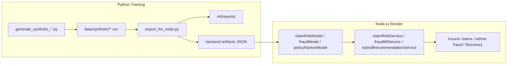

# ML Architecture

## End-to-end flow



## Model split

| Capability | Training | Production inference |
|------------|----------|---------------------|
| Claim risk | Logistic regression + StandardScaler | `claimRiskModel.ts` |
| Fraud ML | Logistic regression + StandardScaler | `fraudModel.ts` |
| Policy ranker | Per-category LR (home/auto/life/pet) | `policyRankerModel.ts` |
| Claims intelligence | N/A | Gemini 2.5 via `claimVisionService.ts` |

## Hybrid recommender

```
finalScore = 0.3 × ruleScore + 0.7 × (mlProbability ?? 0.5) × 100
```

Rules from `recommendationService.ts`; ML probability from per-category ranker artifacts.

## Deployment constraints

- **No Python on Render** — JSON artifacts only (~21 KB total).
- **No Flask/FastAPI** — training is offline (Colab/local venv).
- **No ONNX** unless benchmarked and justified (deferred).
