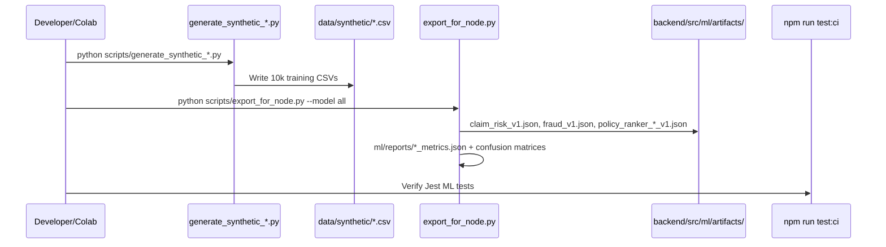

# Training Pipeline

## Sequence



## Commands

```bash
cd ml && source .venv/bin/activate
pip install -r requirements.txt

python scripts/build_policy_manifest.py
python scripts/generate_synthetic_claims.py
python scripts/generate_synthetic_fraud.py
python scripts/generate_synthetic_recommendations.py
python scripts/analyze_datasets.py

python scripts/export_for_node.py --model all
python scripts/benchmark_xgboost.py   # offline only

cd ../clear-clever-backend
npx jest src/claimRisk.test.ts src/fraudMl.test.ts src/hybridRecommendation.test.ts
```

## Algorithm

- **Model:** `LogisticRegression(max_iter=500, class_weight="balanced", random_state=42)`
- **Preprocessing:** `StandardScaler` on one-hot encoded features
- **Split:** 80/20 stratified, `random_state=42`
- **Threshold:** 0.5 (evaluation); Node uses raw sigmoid probability

## Artifact schema

```json
{
  "version": "claim_risk_v1",
  "modelType": "logistic_regression",
  "featureOrder": ["estimated_amount_pkr", "...", "claim_type__accident"],
  "scaler": { "mean": [], "scale": [] },
  "coefficients": [],
  "intercept": 0.0,
  "threshold": 0.5
}
```

Metadata in paired `*.meta.json` includes metrics and source CSV path.
